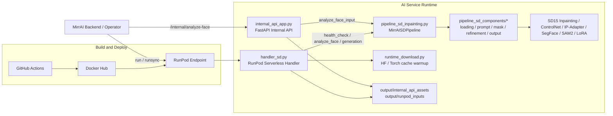

# MirrAI SD Inpainting RunPod Repo

현재 저장소는 MirrAI 헤어 변환 서비스의 운영 런타임, 내부 얼굴형 분석 API, RunPod 배포 자동화, 학습/평가 보조 스크립트를 함께 유지하는 정리본입니다.

## 현재 저장소 기준 확인 사항

- RunPod serverless 런타임 엔트리포인트는 `handler_sd.py`입니다.
- 내부 backend 연동용 FastAPI 엔트리포인트는 `internal_api_app.py`입니다.
- generation backend 레지스트리는 남아 있지만, 현재 활성 backend는 `sd15_controlnet` 하나입니다.
- 생성 요청은 기존 `hairstyle_text`/`color_text` 방식과 `survey_data` 기반 구조화 입력을 모두 지원합니다.
- 생성 응답에는 `build_tag`, `runpod`, `generation_backend`, `request_resolution`이 포함됩니다.
- 내부 API는 `/internal/health`, `/internal/analyze-face`, `/internal/assets/{asset_id}`를 제공합니다.
- GitHub Actions 워크플로는 현재 `build-sd-base`, `build-sd-app`, `build-runpod-diag`, `deploy-sd`, `release-runpod`까지 포함합니다.

## 팀 역할

| 이름 | 역할 | 담당 내용 |
| --- | --- | --- |
| 장완식 | 모델 학습 및 파이프라인 기반 구축 | 모델 학습 환경 구성, 학습·추론 연결 기반 마련, RunPod/배포 흐름 정리, 전체 파이프라인 구조 설계 및 기반 구현 |
| 이병재 | 생성 결과 튜닝 및 품질 개선 | 프롬프트·마스크·합성·후처리 로직 튜닝, 앞머리/성별 분기 보정, 아티팩트 제거, 생성 품질 개선 및 세부 파라미터 최적화 |

## 저장소 범위

- SD 인페인팅 추론 런타임 유지
- RunPod serverless 배포 및 smoke test 경로 유지
- 내부 얼굴형 분석 API 유지
- generation 학습/전처리/평가 스크립트 유지
- 진단용 RunPod handler 및 이미지 빌드 경로 유지
- 대용량 체크포인트, 로컬 산출물, 임시 파일은 `.gitignore`/`.dockerignore` 기준으로 제외

## 핵심 파일

- `handler_sd.py`: RunPod serverless 엔트리포인트
- `internal_api_app.py`: backend 연동용 내부 HTTP API
- `handler_runpod_diag.py`: RunPod 환경 진단용 경량 handler
- `pipeline_sd_inpainting.py`: 메인 SD 추론 파이프라인
- `pipeline_sd_components/`: config / loading / prompt / mask / refinement / output / backend 분리 모듈
- `runtime_download.py`: 런타임 모델 캐시 준비
- `download_weights_sd.py`: 가중치 다운로드 보조 스크립트
- `Dockerfile.sd.base`: 공통 런타임 베이스 이미지
- `Dockerfile.sd.app`: 서비스 앱 이미지
- `Dockerfile.runpod.diag`: 진단용 이미지
- `scripts/`: 배포, smoke test, 학습, 전처리, 평가, 리포트 스크립트

## 시스템 아키텍처



상세 구조와 요청 흐름, 학습/배포 플로우는 [docs/system_architecture.md](docs/system_architecture.md)에 정리했습니다.

## 현재 런타임 구조

- SegFace 기반 hair mask
- SAM2 기반 refinement
- MediaPipe FaceMesh 기반 face protect mask
- Stable Diffusion 1.5 inpainting
- ControlNet canny
- IP-Adapter face
- 길이별 output crop
- cloth preserve / garment prepass / postprocess 보정

### short/medium 처리 메모

현재 short/medium 경로는 생성 후 의상만 복원하는 구조가 아닙니다.

- `source_garment_prepass_mask`로 torso-front / chest-center 영역을 먼저 확보
- `upper_clothes_overwrite`와 short 전용 torso repaint seed를 본 생성 전에 반영
- 본 SD inpainting에서 silhouette를 생성
- 마지막에 `short_lower_tail_cleanup`, `short_lower_cloth_hard_override`, `final_source_cloth_rescue` 등으로 잔여 artifact를 정리

## Generation Backend

현재 허용 backend는 아래 하나입니다.

| key | model | default canvas | note |
| --- | --- | ---: | --- |
| `sd15_controlnet` | `runwayml/stable-diffusion-inpainting` + ControlNet canny | 512 | IP-Adapter 및 runtime LoRA 지원 |

별칭으로 `default`, `legacy`, `sd15`, `sd`, `controlnet`을 받아도 내부에서 `sd15_controlnet`으로 정규화합니다.

세부 내용은 [docs/generation_model_backends.md](docs/generation_model_backends.md)를 봅니다.

## RunPod Serverless API

`handler_sd.py`는 아래 세 가지 모드를 처리합니다.

### 1. Health Check

요청:

```json
{
  "input": {
    "action": "health_check"
  }
}
```

응답 예시:

```json
{
  "status": "ok",
  "build_tag": "v123",
  "generation_backend": "sd15_controlnet",
  "runpod": {
    "endpoint_id": "...",
    "pod_id": "...",
    "gpu_type_id": "..."
  },
  "cuda": {
    "available": true,
    "device": "NVIDIA A40"
  }
}
```

### 2. Analyze Face

요청:

```json
{
  "input": {
    "action": "analyze_face",
    "image": "<base64 or URL>",
    "include_visualization": true
  }
}
```

응답 예시:

```json
{
  "status": "ok",
  "build_tag": "v123",
  "runpod": {
    "endpoint_id": "...",
    "pod_id": "...",
    "gpu_type_id": "..."
  },
  "face_shape": "oval",
  "face_shape_scores": {
    "oval": 0.4211,
    "round": 0.1084
  },
  "golden_ratio_score": 0.7425,
  "face_ratios": {
    "cheekbone_to_height": 0.721334
  },
  "face_bbox": {
    "x1": 205,
    "y1": 74,
    "x2": 598,
    "y2": 602
  },
  "visualization_base64": "..."
}
```

### 3. Hair Generation

기본 생성 요청 예시:

```json
{
  "input": {
    "image": "<base64 or URL>",
    "hairstyle_text": "wolf cut, layered bangs",
    "color_text": "ash brown",
    "top_k": 3,
    "subject_gender": "female",
    "mask_refine_mode": "sam2",
    "generation_backend": "sd15_controlnet",
    "white_tshirt_experiment": false,
    "return_base64": true,
    "return_intermediates": false,
    "mask_debug_only": false,
    "bg_fill_mode": "cv2",
    "lora_path": null,
    "lora_scale": 1.0
  }
}
```

구조화 입력도 지원합니다.

- `survey_data.target_length`: `short | medium | long | bob`
- `survey_data.target_vibe`: `natural | chic | cute | elegant`
- `survey_data.scalp_type`: `straight | waved | curly | damaged`
- `survey_data.hair_colour`: `black | brown | ash | bleach`
- `survey_data.budget_range`: `low | mid | high`
- `survey_data.survey_profile`, `survey_data.question_answers`
- `subject_gender`, `gender`, `gender_branch` 등 legacy alias도 일부 흡수

추가 입력 규칙:

- 이미지 입력은 `image`, `image_base64`, `image_url`, `image_path` 중 하나를 받습니다.
- `hairstyle_text` 또는 `color_text` 중 하나 이상 필요합니다. 단, 구조화 입력이 있으면 텍스트 없이도 보조 해석이 가능합니다.
- `sd_prompt_data.sd_positive`가 있으면 백엔드 제공 프롬프트를 우선 사용합니다.
- `mask_refine_mode`는 `sam2`, `segface_priority`, `segface_only`를 받습니다.
- `generation_backend`는 현재 `sd15_controlnet`만 허용됩니다.
- `model_backend`, `inpaint_backend`도 legacy alias로 흡수합니다.
- 예전 추천 입력 `face_ratios`, `age`, `weights`는 더 이상 지원하지 않습니다.

응답 상위 필드:

- `results`
- `elapsed_seconds`
- `build_tag`
- `runpod`
- `generation_backend`
- `request_resolution`
- `intermediates` (`return_intermediates=true`일 때)
- `intermediate_data` (`return_intermediates=true`일 때)

`results[]` 주요 필드:

- `rank`
- `seed`
- `clip_score`
- `mask_used`
- `mask_refine_mode`
- `generation_backend`
- `image_base64`
- `mask_display_name`
- `pipeline_mask_base64`
- `mask_base64`
- `mask_overlay_base64`
- `face_bbox`
- `output_crop_box`

## Internal AI Service API

실제 계약 문서는 [docs/internal_ai_service_api.md](docs/internal_ai_service_api.md)를 기준으로 봅니다.

- base URL(local): `http://localhost:8000`
- base URL(prod): `https://mirrai.shop`
- docs: `/internal/docs`
- OpenAPI JSON: `/internal/openapi.json`

현재 endpoint:

- `GET /internal/health`
- `POST /internal/analyze-face`
- `GET /internal/assets/{asset_id}`

요청 헤더:

- `X-MirrAI-API-Version: 2026-04-03` 선택 지원
- `Authorization: Bearer <MIRRAI_INTERNAL_API_TOKEN>` 권장
- 또는 `X-Internal-API-Key`

`POST /internal/analyze-face`는 `image_url` 또는 `image_base64` 중 하나를 받습니다.
시각화 이미지는 signed URL 형태로 `image_url`, `image_url_expires_at`에 반환됩니다.

## 설치

런타임:

```bash
python -m pip install -r requirements.txt
```

학습/평가:

```bash
python -m pip install -r requirements-train.txt
```

개발 보조:

```bash
python -m pip install -r requirements-dev.txt
```

## 로컬 실행 예시

RunPod handler:

```bash
python handler_sd.py
```

내부 API:

```bash
uvicorn internal_api_app:app --host 0.0.0.0 --port 8000
```

헬스체크:

```bash
python test_runpod.py --health-check
```

얼굴형 분석:

```bash
python test_runpod.py --analyze-face --image images/1234.jpg --include-visualization
```

샘플 생성:

```bash
python test_runpod.py \
  --image images/1234.jpg \
  --hairstyle "wolf cut, layered bangs" \
  --color "ash brown" \
  --generation-backend sd15_controlnet \
  --top-k 1
```

내부 API health:

```bash
curl http://localhost:8000/internal/health
```

내부 API analyze-face:

```bash
curl -X POST http://localhost:8000/internal/analyze-face \
  -H 'Content-Type: application/json' \
  -d '{
    "image_base64": "<base64>",
    "include_visualization": true
  }'
```

## 검증 기준

빠른 정합성 체크:

```bash
python -m py_compile handler_sd.py internal_api_app.py pipeline_sd_inpainting.py pipeline_sd_components/loading.py pipeline_sd_components/output.py pipeline_sd_components/prompt.py pipeline_sd_components/generation_backends.py runtime_download.py scripts/runpod_release.py
python scripts/test_serverless_handler_contract.py
python scripts/test_internal_api_contract.py
python scripts/test_output_crop_behavior.py
python test_runpod.py --health-check
```

## CI/CD

현재 유지 중인 워크플로:

- `.github/workflows/build-sd-base.yml`: 런타임 base 이미지 빌드/푸시
- `.github/workflows/build-sd-app.yml`: 서비스 앱 이미지 빌드/푸시
- `.github/workflows/build-runpod-diag.yml`: RunPod 진단 이미지 빌드/푸시
- `.github/workflows/deploy-sd.yml`: 수동 배포 및 선택적 smoke test
- `.github/workflows/release-runpod.yml`: 기존 이미지 기준 RunPod endpoint 릴리스

배포 세부 절차는 [README_release_runbook.md](README_release_runbook.md)를 기준으로 봅니다.

## 남겨둔 문서

- [README_release_runbook.md](README_release_runbook.md): 현재 기준 릴리스 런북
- [README_runpod_volume.md](README_runpod_volume.md): RunPod cache volume 유지 메모
- [docs/internal_ai_service_api.md](docs/internal_ai_service_api.md): backend 연동 계약
- [docs/pipeline_runtime_config.md](docs/pipeline_runtime_config.md): 런타임 config 기준
- [docs/generation_model_backends.md](docs/generation_model_backends.md): generation backend 정리
- [docs/system_architecture.md](docs/system_architecture.md): 시스템 아키텍처 상세 문서
- [docs/pr_runpod_gender_branch_prompt_fix.md](docs/pr_runpod_gender_branch_prompt_fix.md): 구조화 입력/성별 분기 관련 변경 메모

## 로컬 전용 / 업로드 제외 메모

실제 제외 규칙은 `.gitignore`, `.dockerignore`를 source of truth로 봅니다.

대표 제외 항목:

- `output/`, `tmp/`, `.tmp-py/`
- `images/`, `dataset_build/`, `tests/`, `cmd/`
- `.env`, `.env.*`
- `pretrained_models/*` 하위 대용량 체크포인트
- `raw_output.json`
- 생성된 `.jpg`, `.png`, `.jpeg`, `.mp4`, `.docx`

단, `models/`와 `data/`는 런타임 코드/메타데이터 때문에 일부가 저장소에 포함됩니다.
