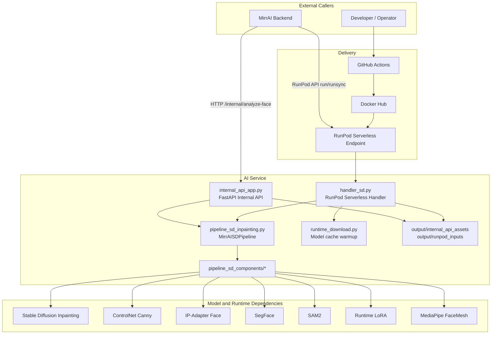
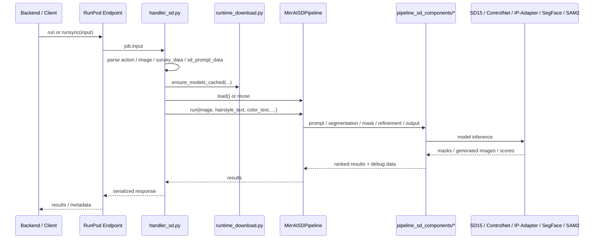
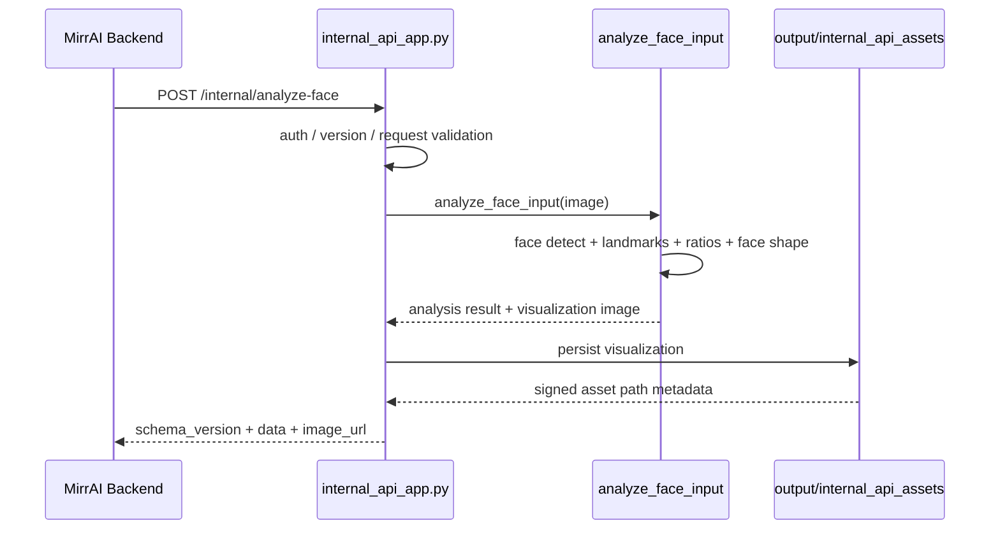
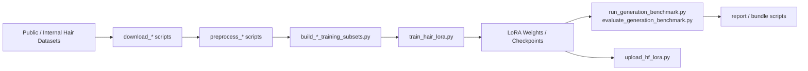
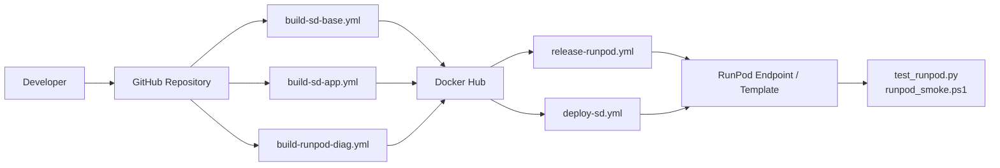

# MirrAI AI Service System Architecture

이 문서는 현재 `SKN22-Final-1Team-AI` 저장소 기준 시스템 아키텍처를 정리한 문서입니다.

범위는 웹 서비스 전체가 아니라, 이 AI 저장소가 담당하는 영역만 다룹니다.

- RunPod serverless 생성 런타임
- 내부 얼굴형 분석 API
- SD 인페인팅 파이프라인
- 모델 캐시 및 추론 자산 관리
- 학습/평가/리포트 스크립트
- Docker / GitHub Actions / RunPod 배포 흐름

## 1. 아키텍처 개요

현재 저장소는 두 가지 진입점을 중심으로 동작합니다.

1. `handler_sd.py`
   - RunPod serverless 엔드포인트 진입점
   - `health_check`, `analyze_face`, `hair generation` 처리

2. `internal_api_app.py`
   - MirrAI backend가 내부적으로 호출하는 FastAPI 진입점
   - `analyze-face`와 signed asset 조회 제공

두 경로 모두 핵심 분석/추론 로직은 같은 저장소 내부 코드와 파이프라인을 공유합니다.

## 2. High-Level Diagram

## 3. 주요 컴포넌트

| 계층 | 파일/디렉터리 | 역할 |
| --- | --- | --- |
| Entry | `handler_sd.py` | RunPod serverless 요청 파싱, health/analyze/generate 라우팅, 응답 직렬화 |
| Entry | `internal_api_app.py` | 내부 FastAPI 계약, 인증/버전 체크, signed asset 반환 |
| Core Pipeline | `pipeline_sd_inpainting.py` | 메인 SD 추론 파이프라인 클래스 `MirrAISDPipeline` |
| Core Components | `pipeline_sd_components/` | 로딩, 프롬프트, 세그멘테이션, 마스크 빌드, 복원, 점수화, output crop 분리 |
| Runtime Cache | `runtime_download.py` | cold start 전에 HF/Torch cache를 준비 |
| Runtime Asset | `output/runpod_inputs` | 원격 URL 입력 캐시 |
| Runtime Asset | `output/internal_api_assets` | 내부 API 시각화 결과 저장 및 signed URL 제공 |
| Model Download | `download_weights_sd.py` | 런타임 관련 가중치 다운로드 보조 |
| Diagnostics | `handler_runpod_diag.py` | RunPod webhook/env 상태 진단용 최소 handler |
| Training | `scripts/train_hair_lora.py` | LoRA 학습 진입점 |
| Evaluation | `scripts/run_generation_benchmark.py` | 로컬 파이프라인 벤치마크 |
| RunPod Ops | `scripts/runpod_release.py` | RunPod template/endpoint 릴리스 자동화 |

## 4. 생성 요청 처리 흐름

생성 요청은 보통 RunPod serverless를 통해 들어옵니다.

### 흐름 요약

1. 호출자가 RunPod endpoint에 이미지와 생성 조건을 전송
2. `handler_sd.py`가 입력을 정규화
3. 필요 시 `runtime_download.ensure_models_cached()`로 모델 캐시 확인
4. `MirrAISDPipeline`를 로드하거나 재사용
5. `survey_data`, `hairstyle_text`, `sd_prompt_data`를 기반으로 프롬프트/조건 해석
6. SegFace, SAM2, MediaPipe 기반 전처리 및 마스크 생성
7. SD15 inpainting + ControlNet + IP-Adapter로 후보 생성
8. 후처리, cloth preserve, composite, output crop 적용
9. 결과를 base64, debug image, metadata 형태로 직렬화해 반환

### Sequence Diagram

## 5. 얼굴형 분석 처리 흐름

얼굴형 분석은 두 경로로 들어올 수 있습니다.

- 내부 backend -> `internal_api_app.py`
- RunPod serverless -> `handler_sd.py`의 `action=analyze_face`

내부 API 경로는 서비스 계약과 signed asset 발급이 포함됩니다.

### Sequence Diagram

### 분석 경로 특징

- 내부 API는 `schema_version`, `response_version`, `request_id`, `processing_time_ms`를 포함한 표준 응답을 만듭니다.
- 시각화 결과는 base64가 아니라 signed URL로 제공합니다.
- 내부 API는 환경 변수 설정 시 bearer token 또는 `X-Internal-API-Key`를 검사합니다.

## 6. 파이프라인 내부 구조

`pipeline_sd_inpainting.py`는 단일 대형 클래스처럼 보이지만, 실제 구현은 `pipeline_sd_components/`로 기능을 분리해 바인딩하는 구조입니다.

| 모듈 | 역할 |
| --- | --- |
| `config.py` | 런타임 설정과 generation backend 관련 기본값 |
| `loading.py` | 모델 로드, device fallback, LoRA 로드 |
| `prompt.py` | 텍스트/구조화 입력 해석, 성별·길이·앞머리 분기, SD 프롬프트 생성 |
| `segmentation.py` | face/hair 관련 세그멘테이션 경로 |
| `mask_builders.py` | 생성/복원/composite용 마스크 생성 |
| `cloth_preserve.py` | 의상 보존 및 복원 처리 |
| `refinement.py` | backend 호출, 복원, inpaint/refine/composite |
| `scoring.py` | CLIP score 기반 후보 점수화 |
| `output.py` | output crop 계산 및 padding crop |
| `generation_backends.py` | 허용 backend 레지스트리 및 pipeline spec |

현재 backend는 `sd15_controlnet`만 활성화되어 있습니다.

## 7. 학습 및 평가 아키텍처

이 저장소는 추론만 있는 것이 아니라, 학습/전처리/평가 스크립트도 함께 관리합니다.

주요 범주:

- 데이터 다운로드: `scripts/download_celeba_dialog_hq.py`, `scripts/download_public_hair_datasets.py`
- 전처리: `scripts/preprocess_celeba_dialog_generation.py`, `scripts/preprocess_external_hair_generation.py`
- subset/bundle 생성: `scripts/build_generation_training_subsets.py`, `scripts/build_runpod_training_bundle.py`, `scripts/build_runpod_longtail_training_bundle.py`
- 학습: `scripts/train_hair_lora.py`
- 평가: `scripts/run_generation_benchmark.py`, `scripts/evaluate_generation_benchmark.py`
- 결과 리포트: `scripts/build_longtail_result_reports.py`, `scripts/build_longtail_data_preprocessing_report.py`

### Training Flow

### 학습 파이프라인 특징

- 학습 산출물 자체는 기본적으로 Git 추적 대상이 아닙니다.
- 일부 LoRA weight는 런타임과 연동되며, 나머지는 Hugging Face 캐시 또는 외부 저장소에서 관리합니다.
- RunPod volume용 bundle 생성 스크립트가 별도로 있어 원격 학습/재현 경로를 지원합니다.

## 8. 배포 아키텍처

배포는 Docker 이미지 빌드와 RunPod endpoint 릴리스로 나뉩니다.

### Deployment Flow

### 현재 유지 중인 워크플로

- `build-sd-base.yml`
  - base image 빌드 및 push
- `build-sd-app.yml`
  - 서비스 앱 이미지 빌드 및 push
- `build-runpod-diag.yml`
  - 진단용 이미지 빌드 및 push
- `deploy-sd.yml`
  - 수동 배포와 선택적 smoke test
- `release-runpod.yml`
  - 기존 이미지를 RunPod endpoint에 릴리스

## 9. 캐시, 스토리지, 환경 변수

### 런타임 캐시

- `HF_HOME`
- `TORCH_HOME`
- `MIRRAI_PRELOAD_ON_STARTUP`

RunPod network volume을 유지하면 cold start 비용을 줄일 수 있습니다.
관련 메모는 [README_runpod_volume.md](../README_runpod_volume.md)를 봅니다.

### 주요 환경 변수

| 변수 | 역할 |
| --- | --- |
| `RUNPOD_ENDPOINT_ID` | RunPod endpoint 식별자 |
| `RUNPOD_POD_ID` | worker/pod 식별자, 일부 환경에서 자동 보정 |
| `RUNPOD_GPU_TYPE_ID` | GPU 식별자 |
| `MIRRAI_BUILD_TAG` | 응답과 릴리스 추적용 빌드 태그 |
| `MIRRAI_GENERATION_BACKEND` | generation backend 선택 |
| `MIRRAI_PRELOAD_ON_STARTUP` | 서버 시작 시 모델 preload 여부 |
| `MIRRAI_INTERNAL_API_TOKEN` | 내부 FastAPI 인증 토큰 |
| `MIRRAI_SERVICE_ENV` | internal API environment 라벨 |

## 10. 운영 포인트

- 현재 generation backend는 사실상 `sd15_controlnet` 단일 운영입니다.
- 구조화 입력(`survey_data`)과 legacy text 입력이 공존합니다.
- `internal_api_app.py`와 `handler_sd.py`는 서로 다른 ingress지만, 분석 로직은 같은 저장소 내부 코드에 의존합니다.
- RunPod 오래된 런타임 호환을 위해 webhook placeholder 환경 변수를 보정하는 로직이 `handler_sd.py`, `handler_runpod_diag.py`에 있습니다.
- 디버그 이미지와 signed asset이 `output/` 하위에 저장되므로 운영 환경에서는 정리 정책이 필요합니다.

## 11. 관련 문서

- [../README.md](../README.md)
- [internal_ai_service_api.md](internal_ai_service_api.md)
- [pipeline_runtime_config.md](pipeline_runtime_config.md)
- [generation_model_backends.md](generation_model_backends.md)
- [../README_release_runbook.md](../README_release_runbook.md)
- [../README_runpod_volume.md](../README_runpod_volume.md)
